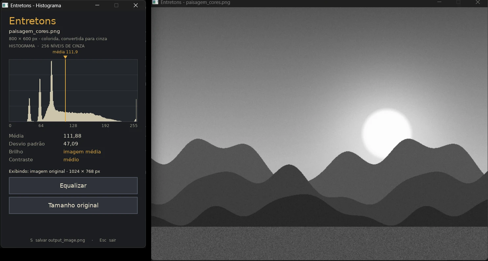
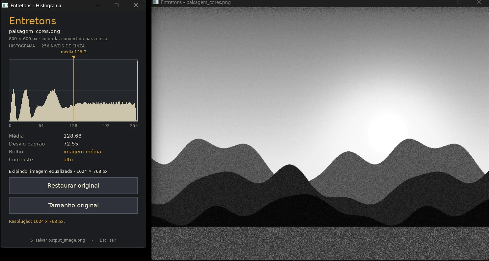

# Entretons

Desenvolvemos o Entretons como Projeto 1 da disciplina de Computação Visual (07G), do curso de Ciência da Computação da Universidade Presbiteriana Mackenzie, com o professor André Kishimoto. É uma ferramenta de linha de comando para analisar e processar imagens em **C**, usando **SDL3**, **SDL_image** e **SDL_ttf**.

Autores: Gabriel Nottoli Buck e Julia Andrade.

Implementamos um programa que recebe uma imagem, converte para escala de cinza quando necessário, mostra o histograma e as estatísticas em uma segunda janela e deixa equalizar o histograma, voltar à imagem original, alternar entre a resolução original e 1024 x 768, e salvar o resultado.

| Imagem original | Após equalizar |
|---|---|
|  |  |

## Funcionalidades

O que implementamos:

1. Recebemos o caminho da imagem pela linha de comando: `entretons caminho_da_imagem.ext`.
2. Validamos o argumento, a existência do arquivo e o formato, e mostramos uma mensagem de erro clara no terminal quando algo dá errado.
3. Detectamos se a imagem é colorida ou já está em escala de cinza. Se for colorida, convertemos com `Y = 0,2125 R + 0,7154 G + 0,0721 B`.
4. Abrimos duas janelas:
   - **principal**: exibe a imagem atual. Começa em 1024 x 768 px, centralizada no monitor principal; se a imagem exceder a resolução da tela nesse tamanho, o canto superior esquerdo vai para (0, 0).
   - **secundária** (filha da principal, 440 x 720 px, tamanho fixo, em (0, 0)): histograma, estatísticas e os dois botões de ação.
5. Exibimos o histograma em 256 níveis, com barras proporcionais e uma marca visual da média, além de média, desvio padrão e a classificação da imagem.
6. **Equalizar** / **Restaurar original**: mantemos a versão original em cinza guardada em memória, então restaurar não recarrega o arquivo.
7. **Exibir 1024 x 768** / **Tamanho original**: alternamos entre a resolução original e 1024 x 768 (interpolação bilinear). A cada troca, redimensionamos e recentralizamos a janela principal, ou a movemos para (0, 0) se não couber na tela.
8. Atualizamos imagem, histograma e estatísticas sempre juntos.
9. Com a tecla **S**, salvamos a imagem exibida em `output_image.png`, sobrescrevendo o arquivo se ele já existir, e informamos o resultado no terminal e na própria janela.

Controles: mouse nos botões da janela secundária, **S** para salvar, **Esc** (ou fechar qualquer janela) para sair.

Formatos aceitos: qualquer um que a SDL_image consiga abrir (PNG, JPEG, BMP, GIF, entre outros).

## Integrantes e contribuições

| Integrante | RA |
|---|---|
| Gabriel Nottoli Buck | 10425384 |
| Julia Andrade | 10427829 |

Dividimos o trabalho por área, revisando o código um do outro ao longo do desenvolvimento:

- **Gabriel** cuidou da base do projeto: carregamento e validação de imagens, conversão para escala de cinza, histograma, equalização, redimensionamento, os testes automatizados e a estrutura de build (Makefile, portabilidade entre Windows e WSL).
- **Julia** cuidou da interface gráfica: as duas janelas, os botões e seus estados visuais, a integração da SDL_ttf com a fonte DejaVu Sans, a identidade visual (cores e layout) e o fluxo principal que liga as ações do usuário ao processamento.

## Requisitos

- GCC com suporte a C11 (compilamos o projeto com `-std=c11`; o enunciado pede C99 ou mais recente) e GNU Make.
- SDL3, SDL_image e SDL_ttf. Usamos **SDL 3.4.16**, **SDL_image 3.4.6** e **SDL_ttf 3.2.2** — as versões mais recentes e estáveis disponíveis quando desenvolvemos o projeto.

Ambientes de avaliação da disciplina: Windows 10/11 com GCC 15.1.0 e WSL Ubuntu 26.04 com GCC 15.2.0. Compilamos e testamos o projeto de fato em Windows 11 (GCC 15.2.0) e em WSL Ubuntu 24.04.1 (GCC 13.3.0); veja a seção [Testes](#testes) para os detalhes.

## Compilação

O `Makefile` procura as bibliotecas nesta ordem:

1. pastas informadas por você (`SDL_PREFIX`, ou `SDL3_DIR` + `SDL3_IMAGE_DIR` + `SDL3_TTF_DIR`), cada uma com `include/` e `lib/`;
2. `pkg-config` (`sdl3`, `sdl3-image`, `sdl3-ttf`);
3. os caminhos padrão do GCC (`-lSDL3 -lSDL3_image -lSDL3_ttf`).

### Windows (GCC / MinGW-w64)

Baixe os pacotes de desenvolvimento para MinGW nas páginas de releases da SDL e informe a pasta `x86_64-w64-mingw32` de cada um. Para não digitar isso toda vez, crie um arquivo `config.mk` na raiz do projeto (ele não é versionado):

```make
SDL3_DIR       = C:/libs/SDL3-3.4.16/x86_64-w64-mingw32
SDL3_IMAGE_DIR = C:/libs/SDL3_image-3.4.6/x86_64-w64-mingw32
SDL3_TTF_DIR   = C:/libs/SDL3_ttf-3.2.2/x86_64-w64-mingw32
```

Depois:

```
mingw32-make          (ou make, conforme sua instalação)
mingw32-make dlls     copia as DLLs do SDL para a pasta do projeto
entretons.exe assets\samples\paisagem_cores.png
```

No MSYS2, se os pacotes `sdl3`, `sdl3-image` e `sdl3-ttf` estiverem instalados, o `pkg-config` resolve tudo sozinho e basta `make`.

### WSL Ubuntu / Linux

Se sua distribuição tiver os pacotes de desenvolvimento do SDL3 (`libsdl3-dev`, `libsdl3-image-dev`, `libsdl3-ttf-dev`), basta:

```
make
./entretons assets/samples/paisagem_cores.png
```

Se não tiver — foi o nosso caso no Ubuntu 24.04, que ainda não empacota o SDL3 —, compile as bibliotecas do código-fonte para uma pasta local:

```
sudo apt install build-essential cmake ninja-build pkg-config libfreetype-dev \
  libx11-dev libxcursor-dev libxi-dev libxrandr-dev libxext-dev libxfixes-dev \
  libxss-dev libxtst-dev libxrender-dev libxkbcommon-dev libgl1-mesa-dev libegl1-mesa-dev

P=$HOME/sdl3
git clone --depth 1 --branch release-3.4.16 https://github.com/libsdl-org/SDL
cmake -S SDL -B SDL/b -G Ninja -DCMAKE_BUILD_TYPE=Release -DCMAKE_INSTALL_PREFIX=$P && cmake --build SDL/b && cmake --install SDL/b

git clone --depth 1 --branch release-3.4.6 https://github.com/libsdl-org/SDL_image
cmake -S SDL_image -B SDL_image/b -G Ninja -DCMAKE_BUILD_TYPE=Release -DCMAKE_INSTALL_PREFIX=$P -DCMAKE_PREFIX_PATH=$P -DSDLIMAGE_VENDORED=OFF && cmake --build SDL_image/b && cmake --install SDL_image/b

git clone --depth 1 --branch release-3.2.2 https://github.com/libsdl-org/SDL_ttf
cmake -S SDL_ttf -B SDL_ttf/b -G Ninja -DCMAKE_BUILD_TYPE=Release -DCMAKE_INSTALL_PREFIX=$P -DCMAKE_PREFIX_PATH=$P -DSDLTTF_VENDORED=OFF && cmake --build SDL_ttf/b && cmake --install SDL_ttf/b

make SDL_PREFIX=$P
```

O WSL precisa de WSLg (Windows 11 ou Windows 10 recente) para abrir as janelas.

### Alvos do Makefile

| Comando | O que faz |
|---|---|
| `make` | compila o executável `entretons` (`entretons.exe` no Windows) |
| `make run IMG=caminho.png` | compila e executa |
| `make test` | roda os testes automáticos (sem abrir janelas) |
| `make dlls` | (Windows) copia as DLLs do SDL para a pasta do projeto |
| `make clean` | remove objetos e executáveis |

## Arquitetura

```
src/
  main.c          fluxo principal: argumentos, carregamento, laço de ações
  image.c/h       carregar e validar, detectar RGB/cinza, converter, copiar, redimensionar, salvar PNG
  histogram.c/h   histograma de 256 níveis, média, desvio padrão, classificação
  equalization.c/h equalização, imagem processada, restauração da original
  gui.c/h         janelas, renderização, botões, eventos
  utils.c/h       mensagens, texto, caminhos, busca de assets
assets/
  fonts/          DejaVu Sans (fonte dentro do projeto, com a licença)
  samples/        imagens de exemplo (uma colorida e três em cinza)
tests/
  test_core.c     testes automáticos
docs/             capturas de tela
```

Organizamos as partes assim:

- `image` só conhece pixels e arquivos. Toda imagem em processamento é uma `GrayImage` (8 bits por pixel).
- `histogram` e `equalization` trabalham só com `GrayImage`, sem depender da SDL de janelas.
- `gui` desenha o que recebe (`GuiView`) e devolve ações (`GuiAction`). Não processa imagem.
- `main` liga tudo: recebe a ação, atualiza o estado, recalcula a imagem exibida e o histograma e chama `gui_update`.

Mantivemos equalização e resolução como estados independentes: a imagem exibida sempre é `original` ou `equalizada`, no tamanho original ou em 1024 x 768. Calculamos o histograma e as estatísticas sobre a imagem exibida, que é a mesma que salvamos em `output_image.png`.

## Decisões de projeto

Algumas exigências do enunciado moldaram diretamente a implementação — o tamanho e a posição da janela principal (1024 x 768 inicial, centralizada, com fallback em (0, 0)) e a posição fixa da janela secundária em (0, 0) vêm de lá, não são escolhas nossas.

Nos pontos que ficaram em aberto, decidimos o seguinte:

**Classificação por brilho** (média das intensidades, faixa dividida em terços): `< 85` escura, `85 a 169` média, `>= 170` clara.

**Classificação por contraste** (desvio padrão): `< 40` baixo, `40 a 69` médio, `>= 70` alto. Uma imagem com todos os níveis igualmente frequentes tem desvio de cerca de 74, então uma imagem bem equalizada cai em "alto".

Deixamos os limiares em constantes documentadas em `src/histogram.h`, fáceis de ajustar.

**Equalização**: implementamos a equalização clássica de histograma pela função de distribuição acumulada,
`s(k) = round(255 * (cdf(k) - cdf_min) / (N - cdf_min))`, onde `N` é o total de pixels e `cdf_min` o menor valor não nulo da CDF. Uma imagem com um único nível de cinza não é alterada. Calculamos a versão equalizada uma vez e a guardamos.

**1024 x 768**: interpolamos a imagem bilinearmente para exatamente 1024 x 768, preenchendo toda a janela. Se a imagem não tiver proporção 4:3, ela fica esticada.

**Tamanho e identidade visual da janela secundária**: escolhemos 440 x 720 px (o enunciado só exige tamanho fixo). O enunciado sugere cores em tons de azul para os estados dos botões como exemplo; optamos por um fundo grafite, textos em creme e acentos âmbar para diferenciar neutro, mouse em cima e clicado sem deixar a interface carregada.

**Transparência**: ignoramos o canal alfa de PNGs com transparência; vale o valor RGB do pixel.

**PNG cinza de 8 bits**: percebemos que a SDL_image 3.4.6 entrega esses arquivos como índices com uma paleta deslocada em 1 nível (255 virava 254). Detectamos esse caso no carregamento e usamos o índice diretamente, preservando os níveis originais. Escrevemos um teste para isso.

**Fonte**: escolhemos DejaVu Sans, guardada dentro do projeto (`assets/fonts`) e localizada a partir da pasta do executável, para o programa funcionar independentemente das fontes instaladas no sistema operacional.

## Testes

```
make test
```

Rodamos 137 verificações: fórmula de conversão para cinza, detecção colorida/cinza, erros de carregamento (arquivo inexistente, pasta, arquivo que não é imagem), histograma e limiares, equalização (inclusive restaurar a original), redimensionamento, PNG salvo e recarregado e funções auxiliares. É preciso rodar a partir da pasta do projeto, pois alguns testes usam `assets/samples`.

Situação da validação: compilamos sem avisos (`-Wall -Wextra -Wpedantic`) em três ambientes:

- **Linux** (Ubuntu 24.04, GCC 13.3): 137/137 testes, janelas em display virtual com cliques simulados, ASan/UBSan sem erros.
- **Windows 11** (GCC 15.2.0, MinGW-w64 via MSYS2, `mingw32-make`): 137/137 testes, executamos `entretons.exe` com `assets/samples/paisagem_cores.png`, com a janela principal centralizada em 1024 x 768, a janela secundária em (0, 0) com 440 x 720, acentos e "×" corretos com a fonte DejaVu Sans embutida, e a tecla S salvando `output_image.png`. Usamos as bibliotecas SDL3 3.4.16, SDL_image 3.4.6 e SDL_ttf 3.2.2 nas versões `-devel-mingw` oficiais, testando `mingw32-make` tanto direto do PowerShell/cmd quanto do Git Bash/MSYS2.
- **WSL Ubuntu 24.04.1** (GCC 13.3.0; não conseguimos confirmar o Ubuntu 26.04/GCC 15.2.0 usado na avaliação, pois é a distribuição instalada na máquina em que testamos): compilamos SDL3, SDL_image e SDL_ttf do fonte (não há pacotes `libsdl3-dev` no APT do 24.04), 137/137 testes, janela aberta via WSLg.

Ainda não testamos: escala do Windows em 125%/150% e imagem com acento no caminho.

## Licenças

- Código do projeto: trabalho acadêmico dos autores.
- Fonte DejaVu Sans: licença Bitstream Vera / domínio público, em `assets/fonts/LICENSE-DejaVu.txt`.
- SDL3, SDL_image e SDL_ttf: licença zlib.
